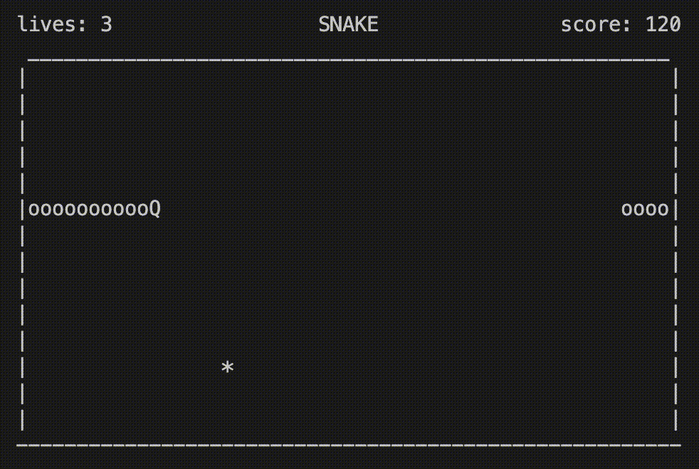

# **SNAKE game**

Этот текст будет красным
Этот текст будет зеленым
## `Цель проекта:`
	Собственная реализация игры Snake на языке программирования C++. 
	Отрисовка осуществляется при помощи библиотеки ncurses.h. 
	Сборка проекта осуществляется с помощью Makefile. 
	Чтобы начать играть прописываем в консоль "make".

## `Цель игры:`
	Набрать как можно больше очков, съедая фрукты на игровом поле.

## `Правила игры:`
	За каждый съеденный фрукт дается 10 очков. 
	С каждым съеденным фруктом скорость змейки увеличивается. 
	У вас есть 3 жизни. 
	Змейка умирает при столкновении с собой же.
1. Управление змейкой осуществляется с помощью нажатия на ↑ , ↓ , ← , →
2. Уменьшить скорость игры можно при нажатии на клавишу "s"
3. Увеличить скорость игры можно при нажатии на клавишу "w"
4. Выйти из игры можно при нажатии на клавишу "q"
5. Приятной игры:)
